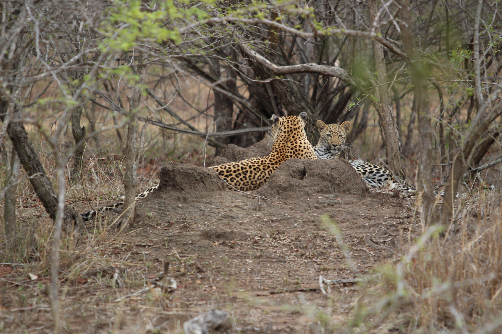

# kmom05 - Bilder

## Bildformat

jpg (jpeg) - fotografier

png - grafik, skärmdumpar

[webp](https://developers.google.com/speed/webp) - Nytt från google

Vad händer när vi väljer fel format?

## 5-minuter: Webbplatser som använder bilder på ett bra sätt?

## Som design

[Design Principer](https://www.canva.com/learn/design-elements-principles/)

### Färg

### Olika sorters blå

### Djup

### Rörelse

## Komposition

### Rule-of-thirds

Gyllene Snittet

### Rörelse in i bilden

### Fokus

## 5-minuter: Webbplatser som använder för många bilder?

## Laddningstider beroende på requests

[jsramverk.se](https://jsramverk.se/)

## Data

[Website Carbon Emissions](https://dannyvankooten.com/website-carbon-emissions/?fbclid=IwAR3bSi6BVR5fhNAoJG5lDrVDMest6IUimvOQf_dtscifZlEAYOXybgLZWuI)

### Stora källor till data mängd

1. Video

1. Bilder

1. JavaScript

1. Typsnitt

1. CSS
